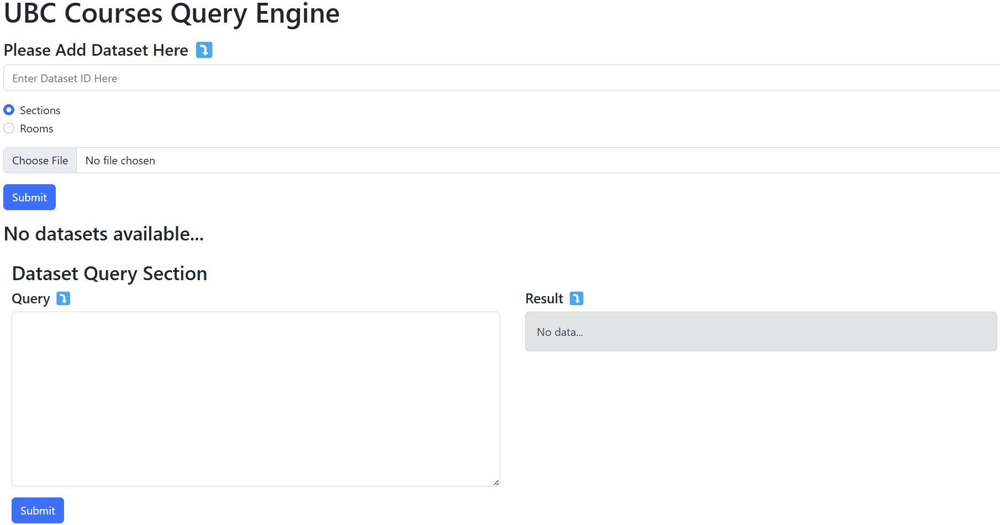

# InsightUBC
## Introduction
InsightUBC is a full-stack application which user can query on classroom information and historical course data.



## Requirement
- Node.js v18
- npm
- yarn

## Build instruction
1. In `frontend` directory, run
   ```shell
   npm install
   npm run build
   ```
2. In main directory, run
   ```shell
   npm install
   yarn install
   npm run build
   ```
## Execute instruction
- In main directory, run
  ```shell
  npm run start
  ```
